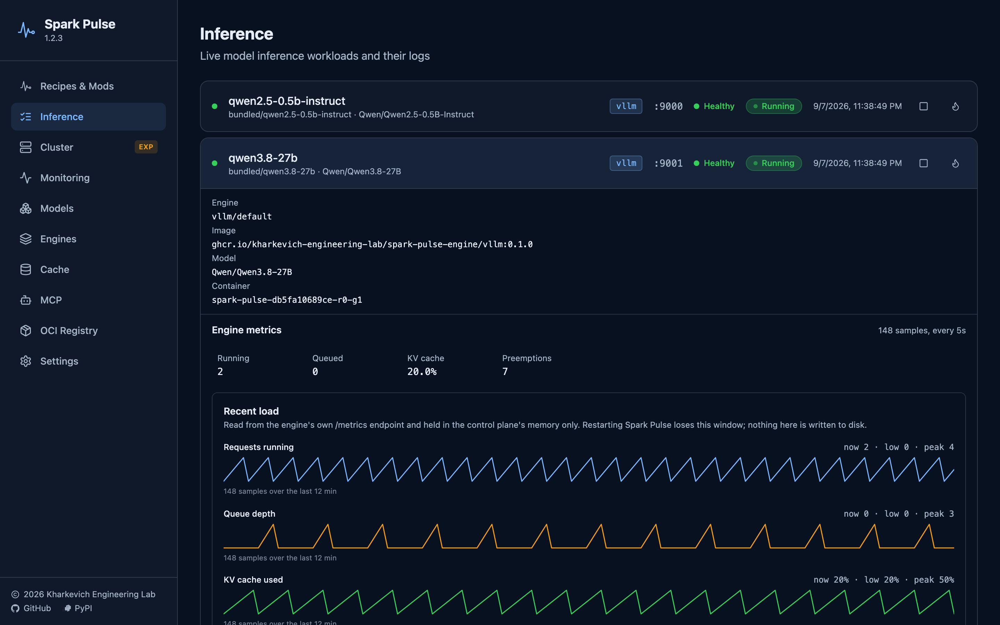
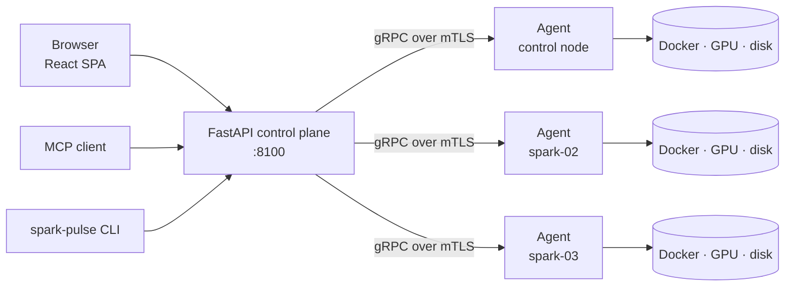

# Spark Pulse

A control plane for running inference engines — vLLM, SGLang, llama.cpp, TensorRT-LLM and others — on NVIDIA DGX Spark hardware, from one browser tab or one API.

It answers four questions that are otherwise four different shell sessions: *what can I run*, *what is running*, *what is each machine doing*, and *what is on each machine's disk*.

> **Not affiliated with NVIDIA.** NVIDIA, DGX and related marks belong to their owners. Spark Pulse is MIT-licensed, © 2026 Kharkevich Engineering Lab.

## The shape of it

One control plane coordinates; one agent per node executes. That is the whole architecture, and it holds even when there is exactly one machine — the control plane runs an agent for itself and reaches it over loopback, so a solo deployment and one rank of a four-node deployment are the same code path.

Nothing in the control plane touches a node's Docker daemon, GPU or model cache directly. Every one of those is a command sent to that node's agent — which is what makes a four-node answer possible at all, and what stops the monitoring page from quietly describing whichever machine the control plane happens to be installed on.

## What you get

| | |
|---|---|
| **Recipes** | A model, an engine and its arguments as one reviewable file. Bundled, your own, or installed from an OCI registry. |
| **One deploy path** | The same form for one machine and for four. A pre-flight runs first and refuses what would fail four minutes later with a worse error. |
| **Live deployments** | Per-rank container state, the engine's own `/metrics` charted, and the log streamed. |
| **Monitoring** | GPU, memory and disk **per node**, with the deployment holding each GPU process named. |
| **Models** | Download from Hugging Face, see per-node presence as *verified / partial / absent*, replicate, and delete across the cluster. |
| **Engines** | Which engine images exist, which nodes hold them, pull and remove across nodes. |
| **MCP** | The same operations as tools for an assistant, implemented by calling this API. |

## Start here

- [Getting started](guide/getting-started.md) — install it, run it, deploy something.
- [A tour of the UI](guide/tour.md) — every page, with screenshots.
- [Architecture](architecture/overview.md) — how the control plane and the agents fit together.

## Status, honestly

Single-node is what this has been run on. **Multi-node is implemented and unverified** — the deploy path, the agent transport and the per-node views all handle N machines, and no two-machine bring-up has confirmed it. The UI says so where it matters rather than in a footnote, and `cluster_experimental` in the config turns the marking off once you have proven it yourself.
