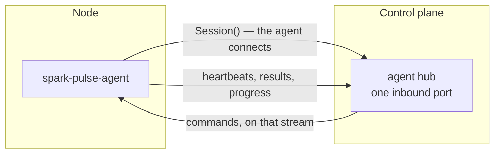

# The node agent

One static Rust binary per node. It dials the control plane, holds a mutually-authenticated gRPC stream open, and executes what arrives on it.

## Why the agent dials out



Three things fall out of that direction. The control plane listens on **one** port for a cluster of any size. Identity is authenticated **once per connection** instead of once per operation. And heartbeat liveness and command-channel liveness become the **same fact** — a node that can be commanded is by definition a node whose stream is up.

## The load-bearing rule of the protocol

**Command outcomes travel as payload, never as a gRPC status.**

Every operation answers with a `CommandResult` whose outcome is either a typed success or a `CommandFailure`.

- A result that arrives means the node was reachable and the outcome is **definite**.
- No result means **unreachable, and the outcome is unknown**.

A gracefully shutting-down gRPC server also returns `UNAVAILABLE`, so a status code cannot carry that distinction and is never asked to. This is the same three-state honesty the UI shows: *verified*, *partial* and **unknown** are different answers, and only the first two are grounds to act.

## Fencing

Every command carries an epoch — the controller's, bumped once per control-plane start. The agent refuses any command carrying an epoch lower than the highest it has seen. Fencing happens **at the resource**, by the process that owns the Docker daemon, so a command from a control plane that has since been replaced cannot act even if it is still in flight. There is no leader election to be on the wrong side of.

## What it can be asked

Container operations — the set a `DockerService` publishes, so the two implementations are signature-identical:

```
run_container · ensure_directories · stop_container · get_container_status
exec_in_container · copy_to_container · get_logs · list_managed_containers
get_container_by_deployment · get_container_by_recipe
image_exists · image_info · list_images · pull_image · remove_image
```

And what the *machine* answers, which has no Docker equivalent:

| Command | Answers |
|---|---|
| `GetFacts` | What the node **is** — GPU count, memory size, kernel. Asked once, at enrolment. |
| `GetNodeStats` | What it is **doing** — utilisation, temperature, free memory, disks, GPU processes. |
| `ListSnapshot` | The files of one model snapshot: path, resolved size, symlink?, does it resolve?, optionally sha256. |
| `RemoveSnapshot` | Delete a revision (leaving shared blobs) or a whole repository. |
| `TerminateProcess` | Signal one process. For the stray holding VRAM that no deployment claims. |

`GetFacts`, `GetNodeStats`, the snapshot pair and `TerminateProcess` are answered even when Docker is down — a node whose daemon has died is exactly when an operator wants to see its GPU and its free space.

## Two rules the agent's own code follows

**Nothing that reads the machine may fail.** A node without `nvidia-smi` still answers, with an empty GPU list and a line in `unavailable` saying why. A panel showing nothing is a worse answer than one saying what it could not read.

**An absent measurement stays absent.** A DGX Spark reports `[N/A]` for GPU memory because the pool is unified. Every measurement is `optional` in the protocol, so absence is representable and never becomes a zero.

## Deciding stays on the control plane

`ListSnapshot` returns names and sizes and **no verdict**. Whether a listing means *verified*, *partial* or *absent* is decided by `hub_cache` against the manifest the control plane already holds.

The arrangement this replaced shipped `hub_cache.py` to each node over SSH and ran it there — a second copy of the verifier on a machine that may not have the interpreter for it. Re-implementing the verifier in Rust would have been a third. A directory listing cannot disagree with itself.
