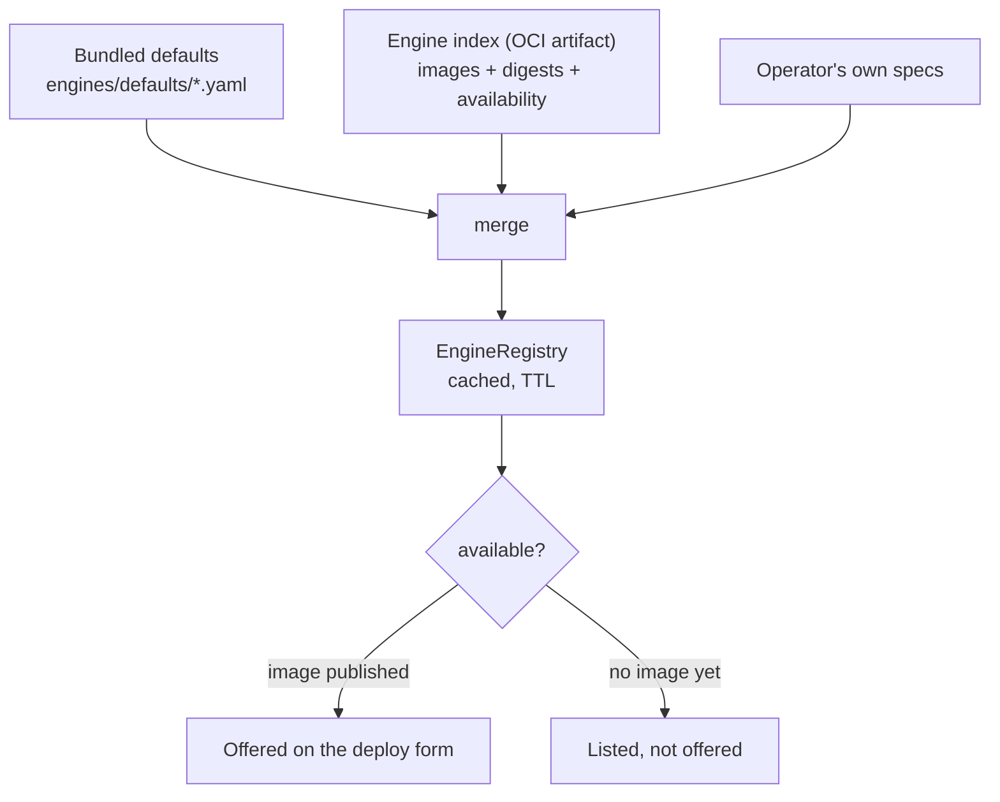

# Engines and the registry

## A plugin, not a template

An engine plugin decides four things a recipe cannot: how to render the launch command, which ports the engine wants, how readiness is decided, and where its metrics live. `ENGINE_CLASSES` maps a name to a plugin; `EngineSpec` is the data half, a pydantic model with `extra="allow"` so an index can carry fields this build has not heard of without failing to load.

## Resolving what will run

At plan time the registry turns *engine + variant* into an exact image reference, and checks the engine's own framework version — the vLLM inside the image, as opposed to the image build. The rendered flags need a recent vLLM, and a tag can resolve to an older image than its name suggests, so the check happens before anything is started rather than in a container log four minutes later.

A recipe written in the v1 format names a `container:` such as `vllm-node`; the registry claims those through `legacy_tags`, so an old recipe resolves to an exact spec instead of a name nobody owns.

## Digest drift

The same tag can resolve to a different image than the one on disk. The Engines page shows that as *newer digest published*, with both digests, rather than silently running last month's build because the tag matched.

## The image registry on the control node

Every node pulls its engine images from a registry on the control node:

- **`local`** — a full registry seeded deliberately. The default, because a pull-through cache's blob expiry has a long-standing sharp edge and a fixed cluster wants determinism.
- **`proxy`** — a pull-through cache holding the upstream credential.

Workers pull anonymously. Registry credentials never leave the control node, which is the same rule the Hugging Face token follows.

## Pre-flight and images

An image that is not on a node yet is a **delay**, not a failure. The pre-flight reports how many bytes have to move and to which node, so "the first four minutes are a pull" is something you are told rather than something you infer from silence.
