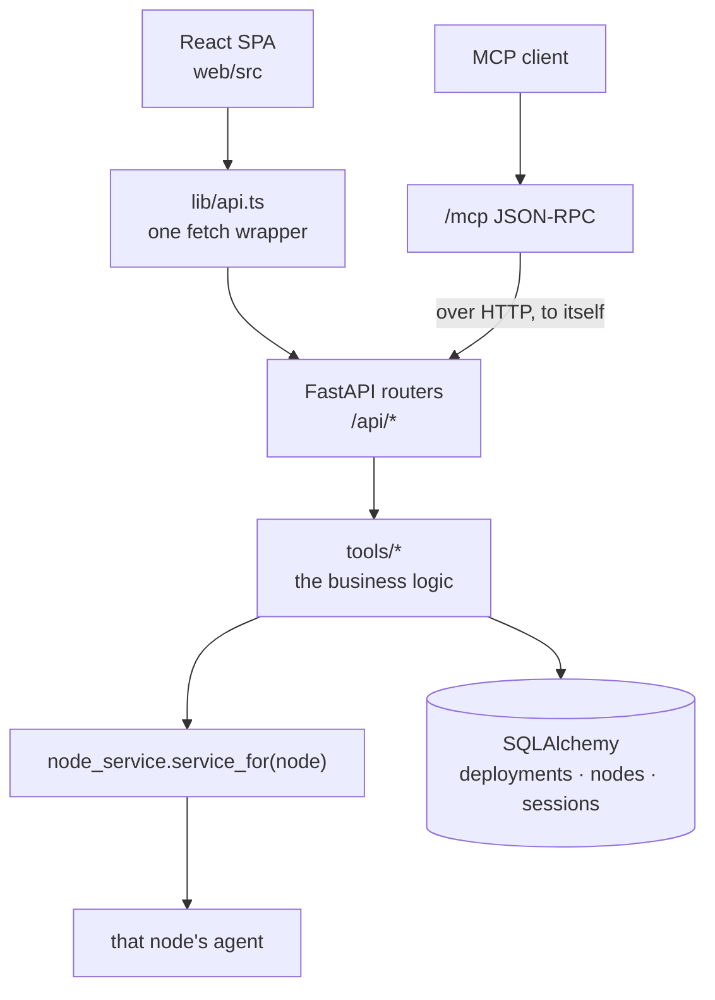

# Architecture

## One rule

**The control plane coordinates; agents execute.**

Anything that lives on a node — a container, an image, a GPU reading, a model snapshot, a process — is reached by naming that node and sending the operation to its agent. Including when the node is the machine the control plane is installed on: this process runs an agent for itself and reaches it over loopback.

That last part is not a detail. The previous boundary had a host argument that defaulted to empty meaning "local", and the contract test written to catch drift hardcoded a remote address — so the local branch was never exercised, and thirteen call sites queried the control node while claiming to reach a worker. There is no local branch left to go untested.

`tests/test_no_local_operations.py` is the ratchet, and it reads the source, because the property is *which module a call goes to*. `./scripts/check-agent-only.sh` runs it and prints what is still excused, with a reason for each.

## The request path

Routers are thin: they call `tools.<module>.<fn>()` and raise `HTTPException`. The MCP endpoint implements every tool by calling this app's own REST API over HTTP at `127.0.0.1`, so MCP behaviour *is* REST behaviour rather than a second implementation that drifts.

## Real and simulated

`spark_pulse/tools/__init__.py` reads `SIMULATION_MODE` once at import and re-exports either the real module or its twin in `spark_pulse/mock/`. Every consumer goes through the package, so the switch applies everywhere at once.

Simulation is not a stub layer: each simulated node has *its own* in-memory Docker, so a peer that answers for the wrong node answers with the wrong containers, loudly. The whole e2e suite and every screenshot in these docs run against it.

## The pieces

| | |
|---|---|
| `tools/native_runtime` | Plans and runs deployments — one container per rank, each through its node's agent. |
| `tools/node_service` | Binds a service to one node. `service_for()` is the resolver, and has no local branch. |
| `agent/` (Rust) | One static binary per node. Executes commands, answers for the machine. |
| `tools/reconciler` | The thread that makes a recorded intent true. |
| `tools/node_stats` | Every node's live GPU, memory, disk and GPU processes. |
| `tools/models`, `tools/hub_cache` | The model cache, its manifests and its verdicts. |
| `engines/` | Engine specs, the index and the registry. |
| `tools/oci_registry` | Recipe collections published as OCI artifacts. |

## The browser boundary

With `auth_enabled` false — the default — this API answers every caller, so the operator's own browser is the boundary. Two rules hold it, both enforced server-side:

- CORS uses an explicit origin list, never `*`. Starlette *reflects* the caller's origin when the wildcard is combined with credentials, which would make every page you visit a client of your control plane.
- A state-changing request carrying a foreign `Origin` is refused. A request with no `Origin` is a non-browser client — curl, MCP, the test client — and passes.

`tests/test_security_boundaries.py` is that contract.

Turning on OIDC adds a login and session cookies over the top; the origin rules stay.
