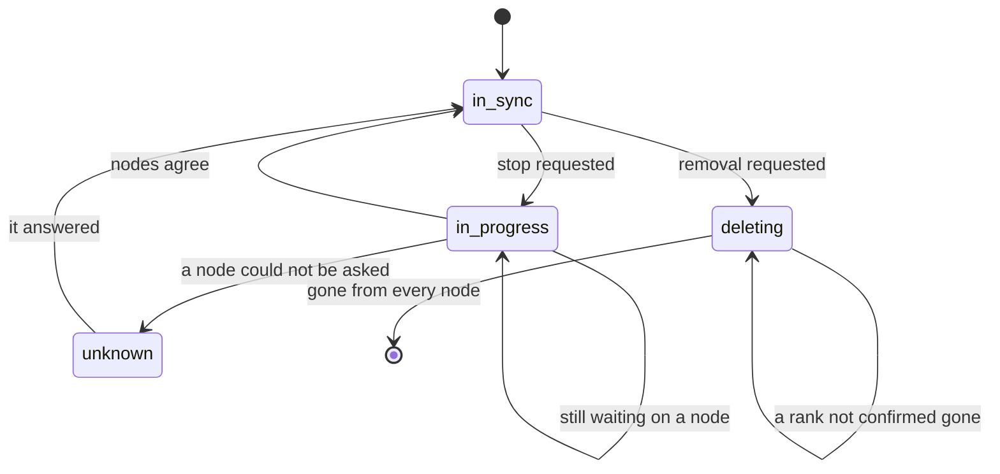

# Reconciliation

## Why a request stopped doing the work

A delete used to tear every rank down on the request's own thread: head first, one node at a time, and on a node that had stopped answering, for as long as the transport waits. The decision was made the moment the request arrived — what the browser held a spinner over was somebody else's timeout.

So the request records the **intent** and returns; a background thread makes it true.

## Two states, kept apart

Every deployment record carries both:

| | |
|---|---|
| `status` | The **lifecycle**: running, pulling, stopped, error. *What is this deployment.* |
| `sync` | **Convergence**: `in_sync`, `in_progress`, `deleting`, `unknown`. *Has what you asked for happened yet.* |

An operator reads both. *Running · deleting* is a real situation, and collapsing it into one word is how a page comes to say "stopped" about a container still holding 90 GB of VRAM.

`unknown` is the third state this codebase keeps insisting on. A node that cannot be asked has not said no: the record is left alone, `sync_reason` says what it is waiting for, and nothing is inferred from silence.

## Stop is not remove

`DELETE /api/deployments/{id}` carries two intents, and `sync_intent` is what keeps them apart now that the work happens later:

- On a **live** deployment it is a *stop* — `in_progress` with intent `stop`. The containers go; the record stays, because a finished run is history somebody reads.
- On one that has **already ended** it is a *removal* — `deleting`. The record itself is what is being cleared.

Collapsing those would delete the thing the operator asked to stop.

## The loop

The reconciler sweeps every five seconds and is **nudged** by the router, so a delete on one healthy node still looks instant: waiting a full interval to start work already asked for would make the asynchronous version feel slower than the synchronous one it replaced, which is how a good change gets reverted.

Three properties it holds:

- It **discovers its subjects on every sweep** rather than being told about them, so nothing has to remember to register a deployment when it is created or unregister it when it is deleted.
- It **survives a sweep that raises** — a thread that dies on one bad record stops converging every other one.
- It **never drops a record whose ranks could not be confirmed gone.** Dropping it would free that node's ports on inference while a container still holds them, and a redeploy would land on top of the container it thought it had removed.

Records written before `sync` existed carry no value and are settled by definition: whatever was last done to them finished on the request's own thread.

## In the UI

`StatusBadge` renders both fields and shows the second chip only when there is something to say. `isSettling()` disables the buttons that would ask again, and the Inference page re-reads the list on a `deployment_sync` event rather than waiting out the ten-second poll — which is what made a delete look like nothing had happened.

## Startup reconciliation

Separately, at startup, the control plane rebuilds its view from what the containers still know. Each managed container carries the deployment it belongs to, which attempt (generation) created it, which rank it is and how many ranks the gang has — so a restart loses nothing, and a control plane coming back up does not report a running deployment as gone.
