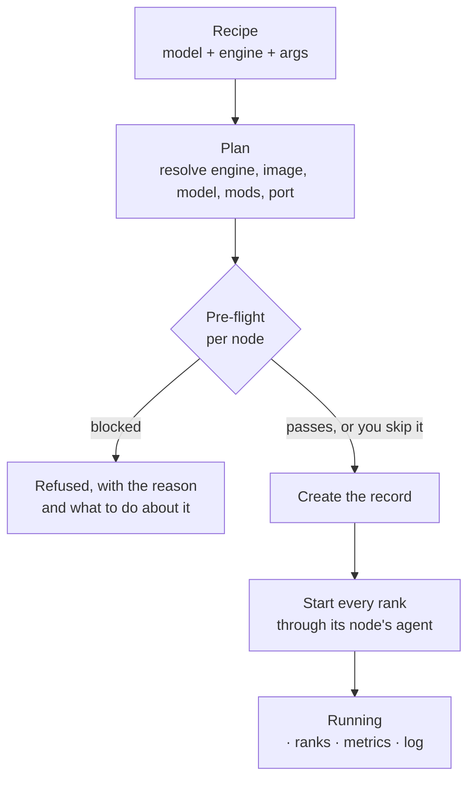
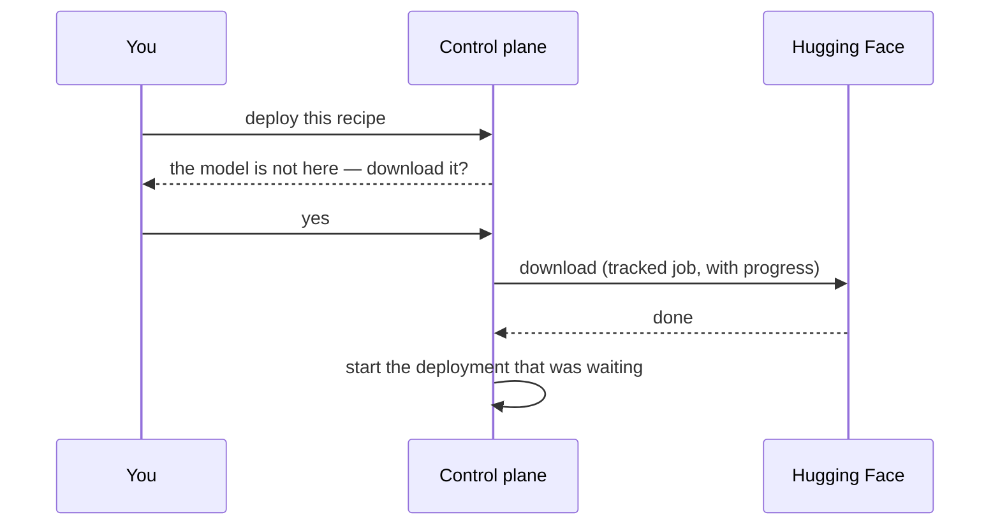

# Deploying a model

## The path a deploy takes

**Plan** resolves everything up front — which engine, which image at which digest, which model, which mods, which port — and starts nothing. It is what the Deploy preview shows you, and it is the same call the API exposes as `POST /api/deployments/plan`.

**Pre-flight** then asks each node the questions a deploy would otherwise discover the hard way: is Docker there, is the image there, is the port free, is there disk, is there memory. A *blocked* verdict refuses the create — every condition it blocks on is one the deploy would hit anyway, minutes later, with a container already pulled and a worse error. `skip_preflight` is there for when you have judged the report wrong.

A pre-flight is honest about the difference between a wait and a failure: an image that is not on a node yet is a **delay**, not a block, and the report says how many bytes have to move first.

## Deploying a model that is not downloaded

The create is not refused. It comes back with a structured `detail.missing_model`, which the UI turns into an offer:

The waiting deployment is recorded, so a restart in the middle of a 26 GB download does not lose it: reconciliation at startup settles anything the completion hook could not.

## One machine or several

The same form. A recipe declares what it needs; if you name several nodes, the deployment is a gang of ranks — one container per rank, each started through its own node's agent, all carrying the same generation so a half-started attempt can be told from a running one.

> Multi-node is implemented and has not been exercised on real hardware. The deploy form says so, and names what specifically is unproven — rendezvous across machines, NCCL interface selection, the pieces that only two physical Sparks can confirm.

## Stopping and removing

Both are the same button in different states, and they are different operations:

- **Stop** ends the containers and keeps the record. A finished run is history you read: which ports it held, which ranks came up, why it ended.
- **Remove** clears the record. That is a second, separate decision.

Either way the request returns as soon as the intent is recorded — the row shows *in progress* or *deleting* while the reconciler makes it true. See [reconciliation](../architecture/reconciliation.md) for why it works that way.

## Mods

A recipe can name mods — a `run.sh` plus assets, applied inside the container before the engine starts. They are copied into each rank's container at deploy time through that rank's node service. Mods are validated before they run: a `run.sh` that would `rm -rf /`, `mkfs`, reboot or shut down the machine is refused, and one that reaches the network is flagged.
