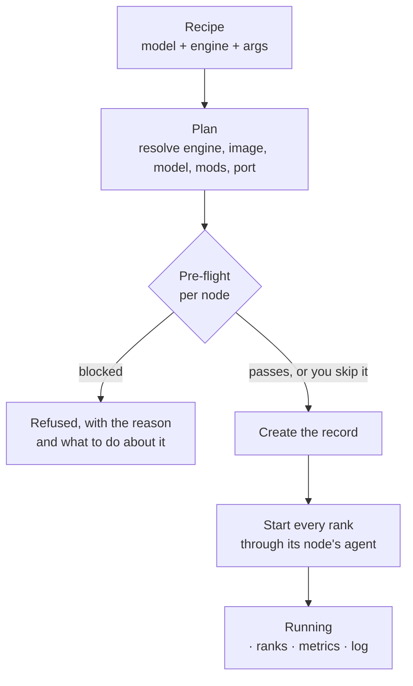
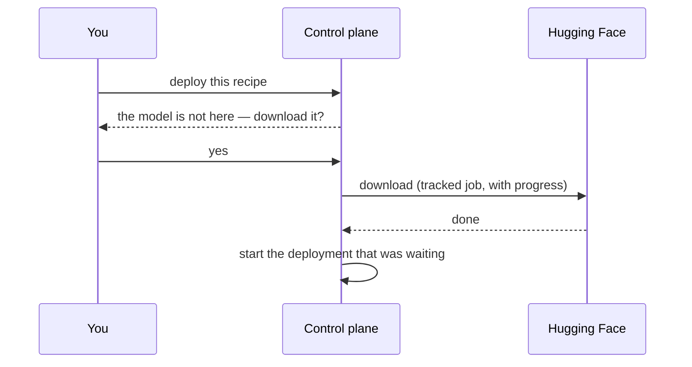

# Deploying a model

## The path a deploy takes


```mermaid
flowchart TD
  R["Recipe<br/>model + engine + args"] --> P["Plan<br/>resolve engine, image, model, mods, port"]
  P --> F{"Pre-flight<br/>per node"}
  F -->|blocked| X["Refused, with the reason<br/>and what to do about it"]
  F -->|"passes, or you skip it"| C["Create the record"]
  C --> G["Start every rank<br/>through its node's agent"]
  G --> S["Running<br/>· ranks · metrics · log"]
```

**Plan** resolves everything up front — which engine, which image at which digest, which model, which mods, which port — and starts nothing. It is what the Deploy preview shows you, and it is the same call the API exposes as `POST /api/deployments/plan`.

**Pre-flight** then asks each node the questions a deploy would otherwise discover the hard way: is Docker there, is the image there, is the port free, is there disk, is there memory. A *blocked* verdict refuses the create — every condition it blocks on is one the deploy would hit anyway, minutes later, with a container already pulled and a worse error. `skip_preflight` is there for when you have judged the report wrong.

A pre-flight is honest about the difference between a wait and a failure: an image that is not on a node yet is a **delay**, not a block, and the report says how many bytes have to move first.

## Ports

A recipe's port is a **preference**. If a node the run will occupy already holds it — a run on record there, or a listener the node itself reports through its agent — the plan moves the run to the first free port in `default_port_range_start`…`_end` and says who held it (*port 8000 is held by run qwen; this run gets 9000*). That is how two runs share a node. A node that cannot be asked is not assumed free: the plan judges it by the records alone, says so, and the pre-flight asks again before anything starts.

A port you type in **Deploy options** (or send as `params.port`) is a **pin**: kept exactly as given, and blocked by the pre-flight if it is taken. Leave the field empty to take the recipe's preference.

Readiness is checked against *this* run's server. Where the engine's readiness path is its model listing (vLLM's `/v1/models`), a 200 has to name the run's served model — `--served-model-name` if the command sets one, else the model as the command hands it to the engine. A 200 naming another model is somebody else on that port: the deploy keeps waiting, and if the deadline passes the error says which model answered.

## Sharing a node

A port is the first thing two runs on one node collide on; memory is the second. `gpu_memory_utilization` (SGLang's `--mem-fraction-static`) is a fraction of the node's **total** memory — on a GB10, the 121 GiB unified pool — and the engine takes all of it at startup. vLLM checks that fraction against what is *free* and refuses with *"Free memory on device … is less than desired GPU memory utilization"*, but only after the image is pulled and the container started.

So the plan does the arithmetic first. For each node the run occupies, it lists the runs already there — live ones, and a stopped one whose containers were never confirmed gone — and what each claims:

- a run whose engine takes a fraction claims that fraction of the node's total;
- a run whose engine allocates as it goes (llama.cpp) claims what the node, asked through its agent, says its containers hold;
- a run whose claim cannot be read — the node did not answer, or reports no memory for it — is **unknown**, never zero.

What is left is the total, less those claims, less 4 GiB for the host itself (the kernel, Docker, the agent: memory no run's fraction may count on). A run that asks for more is **blocked** — *run qwen holds 0.80 (96.9 GiB); at most 0.16 is left and this run asks 0.50* — and an unknown co-tenant turns the check into a warning instead, since the budget has a hole in it. A run alone on its node is judged by the engine, as before.

**GPU memory** in Deploy options sets the fraction (empty takes the recipe's). After a preview, a node somebody else is on gets one line — *Shares spark-01 with qwen (0.80). Up to 0.16 fits.* — and, when the run does not fit, a button that takes that value. The plan carries the same figures as `memory_budget`, one entry per node.

## Deploying a model that is not downloaded

The create is not refused. It comes back with a structured `detail.missing_model`, which the UI turns into an offer:


```mermaid
sequenceDiagram
  participant U as You
  participant CP as Control plane
  participant HF as Hugging Face
  U->>CP: deploy this recipe
  CP-->>U: the model is not here — download it?
  U->>CP: yes
  CP->>HF: download (tracked job, with progress)
  HF-->>CP: done
  CP->>CP: start the deployment that was waiting
```

The waiting deployment is recorded, so a restart in the middle of a 26 GB download does not lose it: reconciliation at startup settles anything the completion hook could not.

## One machine or several

The same form. A recipe declares what it needs; if you name several nodes, the deployment is a gang of ranks — one container per rank, each started through its own node's agent, all carrying the same generation so a half-started attempt can be told from a running one.

## What a recipe serves

A v2 recipe can say what kind of endpoint it starts with a top-level `serves:` — `chat`, `embedding`, `image`, `video` or `speech`. Absent means `chat`, so every recipe written before the field existed is unchanged.

```yaml
recipe_version: "2"
name: Qwen3-Embedding-4B
model: Qwen/Qwen3-Embedding-4B
serves: embedding
engine: vllm
engines:
  vllm: {}
```

- **vLLM** renders `--runner pooling` for `embedding`, unless the recipe's own args (or the deploy's extra args) already name a `--runner`.
- **Every other engine** refuses a kind it does not claim, at plan time and in the recipe's engine table, with the reason. SGLang's `--is-embedding` and `llama-server`'s `--embedding` exist, but nothing here has launched them; a refusal is cheaper than a run that starts and answers the wrong API.
- **The run keeps it.** The deployment record carries `serves` from the moment it is planned, so editing or uninstalling the recipe later does not change what an existing run says it is. A record without the field is `chat`.
- **Benchmarks are chat only.** llama-benchy drives chat completions, so `POST /api/benchmarks` answers 409 for a run that serves anything else, and the run row does not offer the button.
- **v1 serves chat.** Its `command` is a verbatim `vllm serve` line nothing rewrites, so a v1 recipe that claims another kind fails validation; declare it in v2.

`image`, `video` and `speech` are reserved for an engine that serves them; today no engine claims them, so a recipe naming one is refused at plan time. The published schemas are in `spark_pulse/schemas/`.

## Stopping and removing

Both are the same button in different states, and they are different operations:

- **Stop** ends the containers and keeps the record. A finished run is history you read: which ports it held, which ranks came up, why it ended.
- **Remove** clears the record. That is a second, separate decision.

Either way the request returns as soon as the intent is recorded — the row shows *in progress* or *deleting* while the reconciler makes it true. See [reconciliation](../architecture/reconciliation.md) for why it works that way.

## Mods

A recipe can name mods — a `run.sh` plus assets, applied inside the container before the engine starts. They are copied into each rank's container at deploy time through that rank's node service. Mods are validated before they run: a `run.sh` that would `rm -rf /`, `mkfs`, reboot or shut down the machine is refused, and one that reaches the network is flagged.
