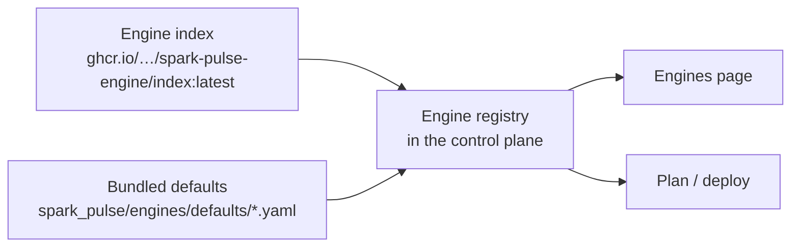

# Engines and images

An **engine** is a plugin plus a published container image. The plugin knows how to render a launch command, which ports the engine listens on, how to tell when it is ready and where its metrics are. The image is what actually runs.

Bundled today: `vllm`, `sglang`, `llama-cpp`, `trtllm`, `modular-max`, `atlas`. A recipe names an engine, or takes the configured default. An engine can have several **variants** — `llama-cpp/default` and `llama-cpp/prism` are one engine with two images — and a deploy picks one.

## What a spec says

```yaml
engine: vllm
variant: default
image: ghcr.io/kharkevich-engineering-lab/spark-pulse-engine/vllm
version: 0.1.0
framework_version: "0.28.1"     # vLLM inside the image, not the image build
arch: [linux/arm64]
gpu_arch: ["12.1a"]             # GB10 is sm_121

runtime:
  serve: vllm serve
  model_arg: positional
  readiness: /v1/models         # how "ready" is decided
  metrics: /metrics             # where the engine metrics come from
  ports: {api: 8000, rendezvous: 29501}
  multi_node: {style: torchrun}
```

`framework_version` is checked at plan time and is not decoration: the rendered launch flags need a recent vLLM, and a tag can resolve to an older image than its name suggests.

**Capabilities** say which topologies an engine claims: `solo` (one node), `cluster` (two — the size NVIDIA publishes guidance for), `mesh` (three or four, which needs either a QSFP switch or the switchless ring, and different NCCL settings from a pair). An engine that does not claim a size is not offered for it.

## Spanning nodes

`multi_node.style` says *how* an engine crosses machines, and each style is a different shape:

| Style | Engine | What each rank runs |
| --- | --- | --- |
| `torchrun` | vLLM | Every rank `vllm serve` with `--nnodes/--node-rank/--master-addr/--master-port`; ranks above zero add `--headless`. |
| `sglang` | SGLang | Every rank the launch server with `--nnodes/--node-rank/--dist-init-addr`. |
| `llama-rpc` | llama.cpp | Workers run `ggml-rpc-server -H 0.0.0.0 -p <ports.rpc>`; rank zero runs `llama-server` and is handed `--rpc host:port,…` naming every worker. |
| `none` | the rest | One node. A second is refused at plan time, with why. |

The RPC style is the one without a rendezvous. Rank zero is the only rank that loads the model, and it connects out to the workers *when it loads it* — so workers are launched first and rank zero last, which is the order every deployment already uses. A worker serves no HTTP and answers no readiness endpoint: readiness is rank zero's, and the other ranks are watched for having exited. The pre-flight checks `ports.rpc` on the workers, which are the machines that bind it.

**Ordering alone is not enough, so rank zero waits for the port.** Measured on a two-node run: worker and head started in the same second, the head dialled `--rpc …:50052` at 0.27s, every endpoint refused — and llama.cpp carried on, because an RPC device it cannot reach is a device that is not there. The model loaded onto the head's own GPU and served from one machine while the run said two, with nothing failing anywhere. So before rank zero is launched, the control plane connects to each worker's RPC port at the node's **registered** address (up to 90s, asked every second). A worker that never listens fails the deploy and is named; a worker whose container has already exited fails at once, with its logs.

**The `--rpc` list is the one launch address that is not the registered one.** Every other engine names a rank where the control plane reaches it, which for a rendezvous is right — a few bytes at startup. RPC is not that: it carries every activation tensor of every token, and a Spark's registered address is usually the management NIC. So each endpoint takes the worker's fabric address when a *verified* fabric apply recorded one that shares a `/24` with the head's — the cable between those two machines, per [the fabric scheme](nodes.md#fabric) — and the registered address otherwise. Nothing is probed to decide it and nothing is guessed: the registry's record of an apply this control plane ran is the evidence, the same evidence model replication uses. A run that fell back says so in the deploy plan's warnings, per worker, with the reason and what to run.

A variant opts in by declaring both halves — `capabilities.cluster: true` and `multi_node: {style: llama-rpc}`. `llama-cpp/default` declares neither and stays solo; `llama-cpp/prism` (PrismML's fork, for their ternary GGUFs) declares both. Claiming the size without naming a style is refused, and the refusal says what to declare.

**The control plane decides where the model bytes come from, not the engine.** `-hf` makes `llama-server` resolve the repository itself and download the GGUF into `LLAMA_CACHE` — which on a real run meant the model was downloaded twice: once to `~/.cache/huggingface` because the control plane refuses a deploy whose model is not in the catalogue, then again by the engine, with the copy [replication](models.md) had already put on the peer ignored. So for any engine declaring `model_arg: -hf`, the plan asks the node that will load the model — the head, through its own agent; the RPC workers load nothing — whether it holds the file, and renders `-m /home/spark/.cache/huggingface/hub/models--…/snapshots/<rev>/<file>` when it does. The recipe's `--hf-file` is the selector and stays the only place a packing is named; it is dropped from the rendered arguments once `-m` is used, because left in it sends `llama-server` back to the hub for the file it was just handed. Nothing here is a refusal: a node that does not hold the file, a repository holding several `.gguf` with no `--hf-file` to choose between them, or a node that cannot be asked all keep `-hf` exactly as before, with a plan warning saying the engine will fetch its own copy. The plan reports which happened as `model_source` (`hf-cache` or `engine-download`) and the resolved path, and the deploy preview shows both — so presence and replication mean the same thing for llama.cpp as for every other engine.

## Where images come from



An index is an OCI artifact listing published engine images and their digests. The registry merges it over the bundled defaults, caches it for `engine_index_cache_ttl_seconds`, and marks each engine `available` or not — an engine whose image has not been published is listed but not offered.

The **Engines** tab of Library (`/engines`) shows per engine: the image, whether this node has it, its size, its digest, and **digest drift** — the same tag now resolving to a different image than the one on disk. Expanding a row asks every node whether it holds that image; a node that cannot be asked is *unknown*, never *absent*, because "we could not ask" is not a reason to pull 26 GB again.

The switch beside an engine's badge enables or disables it, next to the image it gates — the last enabled engine cannot be switched off, because nothing would be deployable. Copying an image to other machines names them first: *copy to every registered node* was one click and, on a four-node cluster, 26 GB a machine.

Which indexes are consulted, the cache lifetime and the default engine are configuration, and are edited in Settings rather than on the page they govern.

## Distributing images across nodes

The control node runs a registry (`image_registry` in the config) and every other node pulls from it:

- **`local`** (default) — a full registry, seeded deliberately with the images you chose. A cache's blob expiry has a long-standing sharp edge, and a fixed cluster wants determinism.
- **`proxy`** — a pull-through cache holding the upstream credential.

Either way, registry credentials stay on the control node: workers pull anonymously from it.

## Adding your own

Point `engine_indexes` at your own index artifact, or drop a spec in the operator's engine directory. A spec can also say `build: {external: true}` with a `tag`, which means *use this image, do not try to build it* — that is how `trtllm`, `modular-max` and `atlas` are wired to images published by other people.
