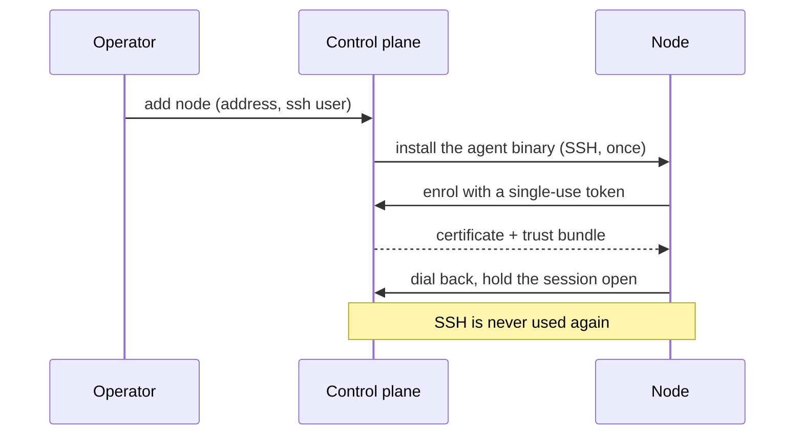

# Getting started

## What you need

- A DGX Spark (or any Linux box with Docker and an NVIDIA runtime) for the real thing.
- Python 3.10 or newer. The dev scripts default to 3.14.
- Docker, reachable by the user Spark Pulse runs as.

For trying it out, none of that: simulation mode runs the whole app against a simulated Spark with no Docker and no GPU.

## Install

```bash
python3 -m pip install spark-pulse
```

That installs the `spark-pulse` command.

## Run it

```bash
spark-pulse start
```

The UI is on `http://localhost:8100` unless you changed `webui_port`. Swagger for the API is at `/docs`.

To run it as a service instead:

```bash
spark-pulse install          # systemd unit, system-wide
spark-pulse install --user   # or a user unit
spark-pulse status
```

## The agent

Every machine Spark Pulse acts on runs an agent — **including the machine the control plane itself is on**. This is not an optional extra for clusters: `service_for()` has no local branch, so with no agent enrolled here, nothing can be deployed at all.



SSH does exactly one job — carrying the agent onto the machine during bootstrap. After that the agent dials the control plane and holds a mutually-authenticated gRPC stream open, so the control plane listens on one inbound port rather than one per node.

## Try it without hardware

Simulation mode gives you the whole UI over a simulated two-node cluster: a GB10 that reports `[N/A]` for GPU memory exactly as the real one does, a Docker daemon in memory, and a model catalogue.

```bash
git clone https://github.com/kharkevich-engineering-lab/spark-pulse
cd spark-pulse
python3 -m pip install -e ".[dev]"
cd web && npm install && npm run build && cd ..
./scripts/run-backend.sh          # http://localhost:8100
```

Everything in [the tour](tour.md) was captured from exactly that.

## Deploy something

1. Open **Recipes & Mods** and pick a recipe.
2. Press **Deploy**. The preview shows the resolved engine, image, model and the command that will run, plus a pre-flight verdict per node.
3. Accept. The deployment appears on **Inference** with its ranks, its engine metrics and its log.

If the model is not downloaded, the deploy is not refused: it offers to download it and starts the deployment when the download finishes.

Next: [deploying a model](deploying.md), or [the tour](tour.md).
