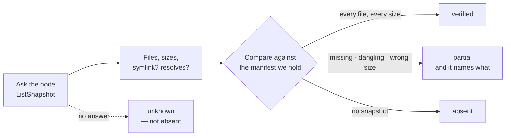

# Models and replication

The **Models** tab of Library (`/models`), with the caches that fill the same
disk as a section under it — `/cache` is still an address, and it opens here.

## The catalogue

Anything in the Hugging Face hub cache (`$HF_HOME/hub`) is a model here, plus anything under a configured `local_path` source. Recipes are consulted only to say which of them reference a given model.

Each entry carries what the config file says — precision, quantization method, context length — and its size on disk, counted through the symlinks so a snapshot reports what it actually occupies rather than the sum of its links.

## Downloading

Downloads are tracked jobs: queued, running with progress and current file, then completed, failed or cancelled. A download started because a deploy needed the model says which deployment is waiting on it, so a progress bar on a page you navigated away from is not an orphan.

## Presence: verified, partial, absent

"Is the model on that node" has three answers, and the middle one is the point.

The check that this replaced ran `test -d …/snapshots` and called a hit *present*. That directory exists after a transfer that copied no symlinks, after one that copied symlinks but no blobs, and after one that truncated every file — so *present* meant nothing.

Now the node lists its snapshot through its agent and the verdict is reached on the control plane, against the manifest the hub published for that revision. A snapshot copied without its blobs is a directory of links that lead nowhere, and it is reported as exactly that.

`deep` additionally compares hashes. It is opt-in because it reads every byte: sizes alone already catch every truncation this stack produces.

## Replicating to other nodes

Replication rsyncs the whole cache entry — blobs, snapshots, refs and trees — with symlinks intact, resumable, uncompressed. All four directories travel together or none of them do: copy the snapshot without the blobs and every link dangles; copy the blobs without the manifest and nothing can ever prove the copy is complete.

**The bytes take the fabric, not the management NIC.** A node is reached at the address it is registered at, and on a Spark that is very often Wi-Fi: measured on a real pair, 20 MB/s there against 428–660 MB/s over the ConnectX fabric — fifteen minutes for a 22 GB model, or under one. So once a fabric apply has come back verified, the node's fabric addresses are on its registry record, and each transfer prefers whichever of them answers on the SSH port right now, falling back to the registered address when none does. Slow beats failed, and the result says which address was used and why, so a transfer that crawls tells you it is on the management link rather than leaving you to infer it from the rate. Nothing else moves: the agent stream, every command, and every event still name the node's registered address.

After the transfer the node's copy is verified against the manifest, and only then renamed into place. A verified replica gets a completion marker recording the revision, the byte count and when it was proven.

Your Hugging Face token never leaves the control plane. Worker containers are handed `HF_HUB_OFFLINE=1`, so a worker missing a file fails loudly instead of quietly re-downloading it over the uplink from every node at once.

## Where a model is, on the row

The table answers "can I delete this" before the dialog is opened. One column, four verdicts, from the presence check above:

| the row says | it means |
|---|---|
| **2 of 2 nodes** | every machine holds a verified copy |
| **gx10-ced2 only** | one machine holds it; the others do not |
| **partial on gx10-ced2** | a machine holds part of a snapshot — worse than none, because it deploys and then fails on a shard nobody notices |
| **not checked** | nobody answered, or nobody was asked; the node's own error is on hover |

A node that could not be reached is never counted as a node without a copy. On a single-machine install the catalogue *is* the answer, and the column says so rather than leaving you to wonder whether it was asked.

## Deleting

Deleting asks which machines. A model replicated to four Sparks is on four disks, and the dialog preselects the nodes presence says hold a copy — a node without one has no disk to reclaim. Every node answers for itself: removed or not, how much it freed, or why it could not be asked, and a node that refused is named rather than folded into "deleted".

Naming a revision leaves the shared blobs alone, because they belong to the revisions that stay. Naming none takes the repository.

## Sources

Where a model id is resolved from — the hub, a mirror, a `local_path` directory — is configuration, and is edited in Settings. The download row here offers the list; it does not own it.
