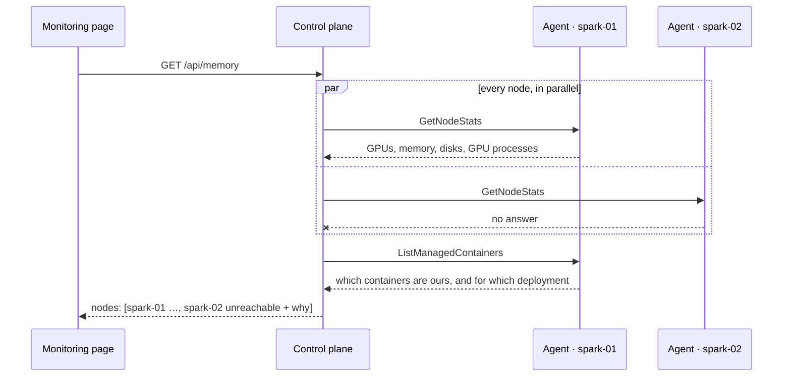

# Monitoring

Two different things are called monitoring here, and they come from different places.

## What the machines are doing

`GET /api/memory` and the `/sse/metrics` stream ask **every registered node** for its own stats through that node's agent — including the machine the control plane runs on.

Two halves decide whether a GPU process is *ours*: the node says which container the process is in — it can read that, the control plane cannot — and the control plane's managed-container list says which containers it started and for which deployment. So a held GPU names the deployment holding it, and anything else is *untracked*.

**Absent measurements stay absent.** A GB10 reports `[N/A]` for GPU memory because host and device share one pool. Every measurement in the protocol is optional, and the page says *unified memory — usage not reported by nvidia-smi* rather than drawing an empty bar for a full machine.

**A node that could not be asked keeps its section** and says why. A missing section and an idle machine look identical on a page.

### Ending a process

`DELETE /api/memory/processes/{pid}?node=…` works on any node:

- If the process is inside a container this control plane started, the **container** is stopped. Killing the process inside would leave the container holding its ports, and whatever supervises it would start the process again.
- Otherwise the process is signalled through that node's agent.

The same pid on two Sparks is two different processes, which is why the node is part of the address.

## What an engine is doing

Separately, a sampler scrapes each running deployment's own `/metrics` — Prometheus text — every five seconds into a ring of 720 readings: one hour, in memory, lost on restart. `GET /api/deployments/{id}/metrics` returns that window with an `available` / `reason` / `detail` triple, so a deployment publishing nothing (SGLang without `--enable-metrics`, an unreachable endpoint, a body nothing recognises) says which of those it is instead of showing an empty chart.

Token throughput is differenced from counters. A counter that goes backwards is an engine restart, so that interval's rate is `null` — never a negative spike.

There are no percentiles: both engines publish histograms only, and inventing a p99 from a histogram bucket would be making one up.

There is deliberately no persistence. Retention is Prometheus's job; this window exists so you can see the last hour without deploying one.
