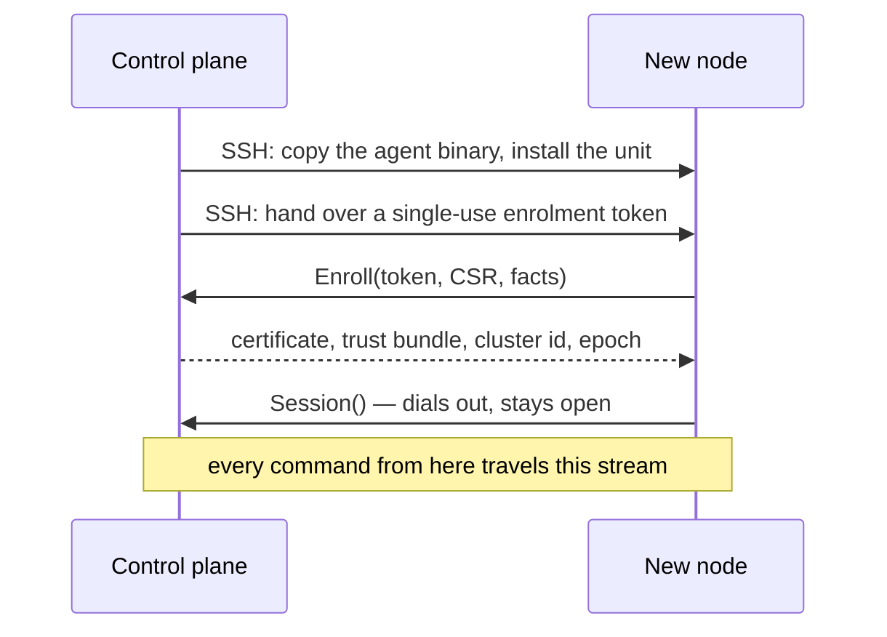

# Nodes and the cluster

## The registry

A node is a record: a minted id, a display name, an address, whether it is the control plane, an SSH user for bootstrap, its interfaces, and a state — `healthy`, `unknown` or `dead`.

The id is **minted by the server** and never derived from a hostname or `/etc/machine-id`. DGX Sparks ship duplicate machine-ids; keying identity on one is how two machines become one record, and a rename must not move a node's identity either.

Adding a node takes an address. Discovery *offers* peers it found over mDNS (`_spark-pulse._tcp`, `_ssh._tcp`), and typing an address always works — nothing requires discovery to have seen anything.

## Bootstrap: SSH once, then never

SSH carries the agent onto the machine and does nothing else afterwards. The agent then dials the control plane, so the control plane listens on one inbound port for a cluster of any size, identity is authenticated once per connection, and heartbeat liveness and command-channel liveness are the same fact.

The node's private key never leaves the node; the CA key never leaves the control node.

### Installing from the browser

Adding a node registers an address. The install that follows — offered as soon as the node is added, and again from the **Install agent** action on any peer's row — is where the SSH login happens, and it happens once:

1. **Credentials.** The SSH user, and one of three ways in: a **password** (used once to place the control plane's public key on the node, then verified without it), a **private key** pasted or uploaded from the browser, with its passphrase if it has one, or the **control plane's own key** for a node whose `authorized_keys` already holds it. A sudo password is optional and used only if the node needs something elevated — enabling lingering, say, or writing a system unit.
2. **Host key.** Before anything is sent, the dialog asks the node for its SSH host key and shows the fingerprint, the same `SHA256:…` that `ssh-keygen -lf /etc/ssh/ssh_host_ed25519_key.pub` prints on the node. The install carries the fingerprint you saw, and refuses if the node offers a different one in between.
3. **Report.** Whether the agent dialled home, which unit scope was chosen and why, every step, every privileged call, and anything the install went ahead without.

None of the secrets is kept. The registry keeps the SSH user; the node keeps the control plane's public key, which is what every later SSH — a model rsync, a reinstall — presents. A key you supplied is unlocked on the control plane and used to log in from there; it is not sent to the node.

The API is the same two calls: `GET /api/nodes/{id}/host-key`, then `POST /api/nodes/{id}/install`.

### The hardware fingerprint

Enrolment records a fingerprint of the machine — a board serial where one is readable, otherwise a hash of the physical interface names, CPU count, memory and machine-id — and every later connection is compared against it, so a node rebuilt under an already-accepted identity is *denied and surfaced* rather than trusted. Docker's interfaces (`docker0`, `br-*`, and the `veth*` end of every container) are excluded: they come and go with workloads, and a fingerprint that moved when a container stopped would deny a node for running one.

The control node is the one machine that cannot be surfaced to anybody — a denied control node is a control plane that exits at startup — so if its own ledger denies it, it says so in the log and re-enrols under the same identity.

## Diagnostics

Each finding names a remedy, because every condition here is one the cluster can run with — the cost is confusion, not failure:

| Finding | What it means |
|---|---|
| `duplicate_machine_id` | Two nodes report the same `/etc/machine-id` — a known defect on this hardware. Identity here is unaffected, but DHCP leases and mDNS responders keyed on it will fight. |
| `mdns_hostname_churn` | One address has answered under more than one mDNS hostname. That is what a duplicate machine-id looks like from outside, and why a peer seems to move. |
| `interface_no_link_local` | An interface is up with no IPv6 link-local address, which silently disables every `ff02::1` peer sweep on that link. |
| `mdns_unavailable` | Informational: discovery degraded to an empty list. Manual entry still works. |

## Fabric

Discovery reads this host's interfaces and RoCE devices, and works out how it is cabled: `direct` (one cable — a pair, or a QSFP switch) or `mesh` (the switchless three-node ring). The distinction matters because a mesh needs NCCL settings a pair must not get.

RoCE devices are recorded as they appear in `/sys/class/infiniband` — `rocep1s0f1`, not the netdev it drives — and **both** twins of every cabled port are kept: one QSFP port is two RoCE devices sharing a PCIe x4 pair, and naming only one halves the bandwidth silently.

## What "cluster" means here

There is no separate cluster object. A cluster is a deployment of size N: the machines come from the node registry, and what is running on them comes from the deployments. The orchestrator that once owned a `cluster` concept — with its own labels, health checks and REST surface — was removed, and the pages were rebuilt on the two APIs that survived it.
