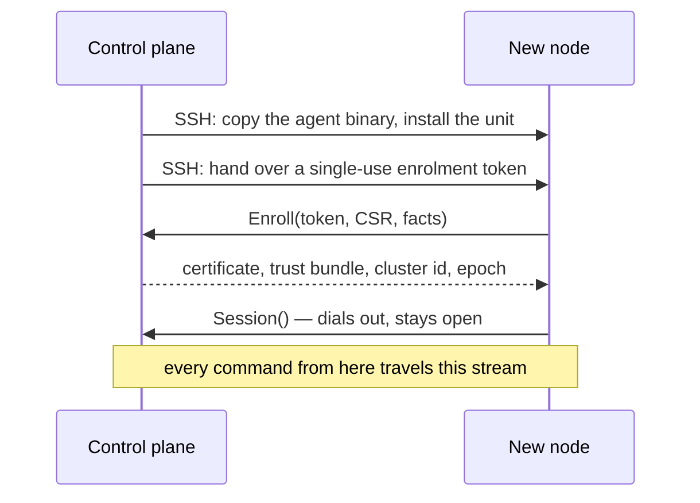

# Nodes and the cluster

## The registry

A node is a record: a minted id, a display name, an address, whether it is the control plane, an SSH user for bootstrap, its interfaces, and a state — `healthy`, `unknown` or `dead`.

The id is **minted by the server** and never derived from a hostname or `/etc/machine-id`. DGX Sparks ship duplicate machine-ids; keying identity on one is how two machines become one record, and a rename must not move a node's identity either.

Adding a node takes an address. Discovery *offers* peers it found over mDNS (`_spark-pulse._tcp`, `_ssh._tcp`), and typing an address always works — nothing requires discovery to have seen anything.

## Bootstrap: SSH once, then never

SSH carries the agent onto the machine and does nothing else afterwards. The agent then dials the control plane, so the control plane listens on one inbound port for a cluster of any size, identity is authenticated once per connection, and heartbeat liveness and command-channel liveness are the same fact.

The node's private key never leaves the node; the CA key never leaves the control node.

### Installing from the browser

Adding a node registers an address. The install that follows — offered as soon as the node is added, and again from the **Install agent** action on any peer's row — is where the SSH login happens, and it happens once:

1. **Credentials.** The SSH user, and one of three ways in: a **password** (used once to place the control plane's public key on the node, then verified without it), a **private key** pasted or uploaded from the browser, with its passphrase if it has one, or the **control plane's own key** for a node whose `authorized_keys` already holds it. A sudo password is optional and used only if the node needs something elevated — enabling lingering, say, or writing a system unit.
2. **Host key.** Before anything is sent, the dialog asks the node for its SSH host key and shows the fingerprint, the same `SHA256:…` that `ssh-keygen -lf /etc/ssh/ssh_host_ed25519_key.pub` prints on the node. The install carries the fingerprint you saw, and refuses if the node offers a different one in between. A successful install then records that key in the control plane's own `known_hosts` (`~/.config/spark-pulse/ssh/known_hosts`), which is what every later `ssh`, `scp` and `rsync` verifies against under strict checking — so a model replication to a node you just onboarded works without `ssh-keyscan`, which would have trusted whatever answered rather than what you confirmed. A fabric apply adds the same key under the node's fabric addresses. A node onboarded before this existed is recorded the next time its agent is *installed* through this dialog — with the control plane's own key, since the node already holds it. The stream update (*Update agent*) does not record it: only the SSH install sees the host key, and the agent does not report one.
3. **Report.** Whether the agent dialled home, which unit scope was chosen and why, every step, every privileged call, and anything the install went ahead without.

None of the secrets is kept. The registry keeps the SSH user; the node keeps the control plane's public key, which is what every later SSH — a model rsync, a reinstall — presents. A key you supplied is unlocked on the control plane and used to log in from there; it is not sent to the node.

The API is the same two calls: `GET /api/nodes/{id}/host-key`, then `POST /api/nodes/{id}/install`.

The node dials the control plane by the control node's registry address (or the `control_host` in the request), and checks that name against the control plane's listener certificate before it trusts anything. That certificate is issued at every start, for every name this machine could be dialled by at that moment: its hostname, bare and `.local`, every interface address, the registry's address for it, and loopback. An address that is not covered — one the machine acquired after startup, say — is refused by the install *before* anything is put on the node, naming the addresses that would work; a restart of the control plane picks the new one up.

### The hardware fingerprint

Enrolment records a fingerprint of the machine — a board serial where one is readable, otherwise a hash of the physical interface names, CPU count, memory and machine-id — and every later connection is compared against it, so a node rebuilt under an already-accepted identity is *denied and surfaced* rather than trusted. Docker's interfaces (`docker0`, `br-*`, and the `veth*` end of every container) are excluded: they come and go with workloads, and a fingerprint that moved when a container stopped would deny a node for running one.

The control node is the one machine that cannot be surfaced to anybody — a denied control node is a control plane that exits at startup — so if its own ledger denies it, it says so in the log and re-enrols under the same identity.

## The doctor

**Diagnose** on a node's row asks the doctor why it is not working. It reads only — the hub already knows the agent's liveness, version and what its Docker daemon answered, and the checks that need the machine (the unit, lingering, the docker socket, identity files, reachability, disk, clock) use the control plane's key over SSH. Every finding says which of three kinds it is: fixable from here, needs a decision (re-enrolment destroys identity, so a program never does it), or needs someone on that machine (a dead disk, a daemon that will not start, a wrong clock).

**Repair what is fixable** acts only on the first kind and checks again afterward. It is the one button that changes anything, and each repair says what it did — a docker-group add now restarts the user's service manager so the group is in effect, rather than sending you to log in again. The control node is diagnosed the same way over its own agent, but not repaired over SSH: upgrade and restart the control plane instead.

The API is `GET /api/nodes/{id}/doctor` (diagnose) and `POST /api/nodes/{id}/doctor` (treat).

## Diagnostics

Each finding names a remedy, because every condition here is one the cluster can run with — the cost is confusion, not failure:

| Finding | What it means |
|---|---|
| `duplicate_machine_id` | Two nodes report the same `/etc/machine-id` — a known defect on this hardware. Identity here is unaffected, but DHCP leases and mDNS responders keyed on it will fight. |
| `mdns_hostname_churn` | One address has answered under more than one mDNS hostname. That is what a duplicate machine-id looks like from outside, and why a peer seems to move. |
| `interface_no_link_local` | An interface is up with no IPv6 link-local address, which silently disables every `ff02::1` peer sweep on that link. |
| `mdns_unavailable` | Informational: discovery degraded to an empty list. Manual entry still works. |

## Fabric

Every node's ConnectX-7 ports are read from what its agent reports on each heartbeat — the RoCE devices under `/sys/class/infiniband`, the netdev each drives, whether the port is active, and the address and MTU on it — so the Cluster page's **ConnectX fabric** card and the deploy pre-flight see the same thing without logging in.

The shape is worked out from the cabling, with one thing `spark-vllm-docker`'s `autodiscover.sh` cannot know: how many nodes there are.

| Ports up per node | Nodes | Shape | NCCL |
|---|---|---|---|
| 2 (one cable, both twins) | any | `direct` — a pair, or a QSFP switch | both RoCE twins in `NCCL_IB_HCA` |
| 4 (both cables) | 2 | `dual` — both cables between a pair | all four twins, **no** mesh settings |
| 4 (both cables) | 3 | `mesh` — the switchless ring | all four twins plus `NCCL_NET_PLUGIN=none`, `NCCL_IB_SUBNET_AWARE_ROUTING=1`, `NCCL_IB_MERGE_NICS=0` |
| anything else | | refused, by number | |

One cable already carries 200G: each QSFP port is two PCIe x4 links, and NCCL reaches the full rate only when told both RoCE twins. NVIDIA's two-node playbook allows a second cable between two Sparks with all four interfaces addressed; upstream measured no noticeable gain. Both shapes are planned, and the second cable is never given the mesh's settings — `NCCL_IB_MERGE_NICS=0` would throw away exactly the aggregation it is for.

The ring is cabled as NVIDIA's three-Spark playbook draws it: node 1 port 0 to node 2 port 1, node 2 port 0 to node 3 port 1, node 3 port 0 to node 1 port 1, where port 0 is the QSFP port next to the RJ-45. It coordinates over the 10G RJ-45 port (`enP7s7`), so the card flags a ring member whose 10G port has no link. Wi-Fi coordination works with a warning.

RoCE devices are recorded as they appear in `/sys/class/infiniband` — `rocep1s0f1`, not the netdev it drives — and **both** twins of every cabled port are kept: one QSFP port is two RoCE devices sharing a PCIe x4 pair, and naming only one halves the bandwidth silently.

### Configuring it

A Spark arrives with its ConnectX ports under NetworkManager's generic DHCP profiles, so a cabled port sits with no address and the pre-flight refuses a multi-node deploy on it. The card plans every node at once, from `NETWORKING.md`'s own scheme: a static `/24` per cable (`192.168.177.0/24` on the lowercase twin, `178` on its capital-P twin; `187/188` and `197/198` for the mesh's other two cables), hosts `.11`, `.12`, `.13` in registry order, MTU 9000, IPv6 link-local off. Each node's `/etc/netplan/40-cx7.yaml` is shown before anything is written.

A node whose fabric is already valid — an address on the lowercase twin, the twins on different subnets, jumbo frames — is left alone and reported as configured, whatever scheme it follows; **Re-address nodes that are already configured** is the one way to overrule that, for a cluster half on one scheme and half on another.

**Configure fabric** applies the plan through each node's own agent — no SSH, and the control node is reached over its own agent like any peer, so it needs no SSH user. The agent drives `nmcli`, which is how DGX OS manages these ports; a raw `/etc/netplan` file made `netplan generate` parse the node's NetworkManager files and one malformed sibling then blocked the apply. The agent quiets any competing profile on a port, brings the connection up, reads the address and MTU back, and pings every peer the plan put on the same subnet. A cable that does not go where the plan assumed is a ping that fails with the link named.

The agent is rootless, so it is granted exactly one privileged command — `sudo nmcli` — by a sudoers drop-in the installer writes (`/etc/sudoers.d/spark-pulse-agent-nmcli`). That is the OS-level half of a two-layer allowlist; the agent's own code refuses to run anything but `nmcli` that way. A node installed before this grant existed, or the control node (which was never installed over SSH), needs the drop-in written once before its fabric can be configured over the agent.

A deploy pins NCCL from the node's registry record — `ethernet_interface`, `infiniband_interfaces`, `fabric_mode` — which the control node fills for itself at startup and nothing used to fill for a peer. A verified apply writes them now, and a node that was already configured by hand is pinned by the same action without a login. The card says whether each node is pinned.

A verified apply also records the addresses it read back, as `fabric_addresses`. That record is what lets a model replication move its bytes over the fabric instead of the management NIC, and the node's confirmed host key is trusted under each of those addresses at the same time, so the transfer passes strict host-key checking without a second scan of anything. A mesh node keeps all of them: it sits on a different `/24` with each peer, and only one of them faces this machine.

For a scheme the planner does not produce, each node's file is editable in the Configure dialog before it is applied. An edited file is written to the node verbatim; the plan's addresses and peer pings no longer describe it, so verification confirms only that the plan's ports came up with an address. A node the plan left configured becomes a target the moment it has an edited file, without turning override on for the rest.

The API is `GET /api/fabric` (the ports and the plan) and `POST /api/fabric/apply` (with an optional `files` map of node id to netplan text for the expert path).

## The agent's version

Every agent reports its version and the SHA-256 of its own binary on each heartbeat. The node list shows the version beside each peer, and says **update available** when the binary is not one this control plane ships — decided from the digest, not the version string, because a version is baked in at build time and can be stale while the bytes are what they are. An older agent that reports no digest is judged by version.

**Update agent** on a peer's row updates it **over the agent's own stream — no SSH**. The control plane sends the bundle it packages; the agent unpacks it beside the running one, verifies the new binary runs, repoints `current`, replies, and restarts its unit onto it. SSH is only for the first bootstrap; a node that already runs an agent never needs it again to move version. The control node's own agent is the packaged binary, so `pip install --upgrade spark-pulse` and a service restart update it.

**Automatic updates** are on by default (`agent_auto_update`, Settings → Cluster; env `SPARK_PULSE_AGENT_AUTO_UPDATE`). A background sweep pushes the packaged bundle to any connected peer whose running binary — matched by SHA-256, not version string — is not the one this control plane ships, so a fleet does not drift behind after an upgrade. Turn it off to pin versions and update by hand. `POST /api/nodes/{id}/update` is the manual trigger.

Releases build the agent with the version semantic-release is about to publish (`SPARK_PULSE_VERSION` into `scripts/build-agent.sh`); before that, every shipped agent reported the version in the checked-in `pyproject.toml`, whatever the release was.

## What "cluster" means here

There is no separate cluster object. A cluster is a deployment of size N: the machines come from the node registry, and what is running on them comes from the deployments. The orchestrator that once owned a `cluster` concept — with its own labels, health checks and REST surface — was removed, and the pages were rebuilt on the two APIs that survived it.
