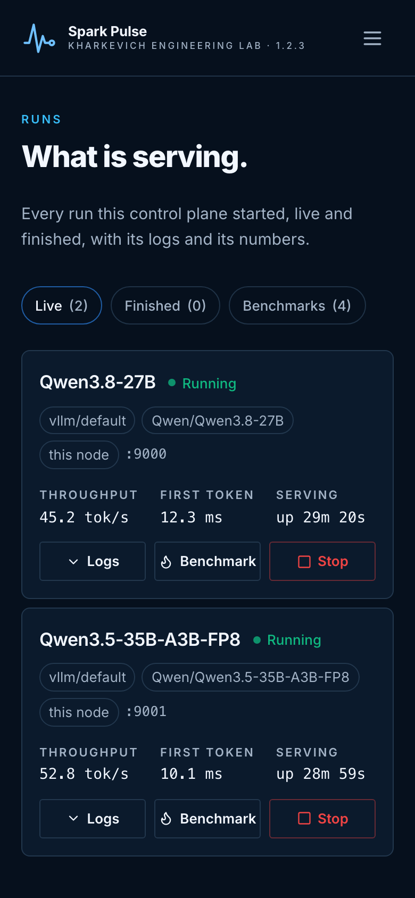
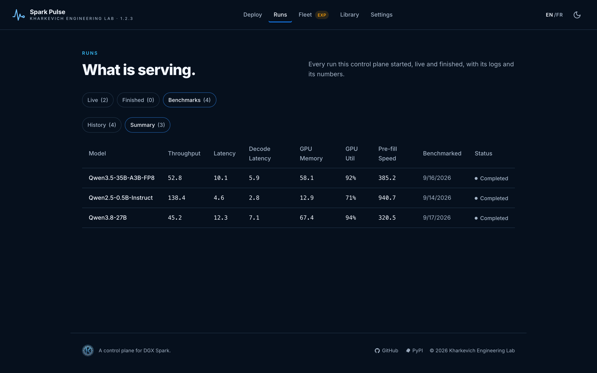

# A tour of the UI

Every screenshot here comes out of simulation mode, captured by `web/scripts/capture-screenshots.mjs` against a simulated two-node cluster. Re-run it and you get these images again — a page that changes and a screenshot that does not is documentation that lies.

## The shell

One sticky header carries everything: the brand and the running version on the left, five groups in the middle, and the language, theme and — when auth is on — who you are and the way out on the right. The groups are **Deploy**, **Runs**, **Fleet**, **Library** and **Settings**; the routes are unchanged, and a group is marked for any page it covers, so `/monitoring` lights up Fleet rather than nothing.

Under 900px the groups fold into a menu button. The menu opens beneath the header — it never covers the page — closes on Escape or on a choice, and carries the same language, theme and sign-out controls, which is why signing out now works on a phone.

## Recipes & Mods

A recipe is a model, an engine and its arguments in one file. The card says which engines can serve it, where it came from (bundled, `custom-`, or installed from an OCI collection), and whether it fits on one machine or wants several. A recipe already running is marked, so you do not deploy a second copy of the same thing by accident.

**Custom mode** switches the page to what you wrote yourself: your own recipes and mods, with an editor and a delete on each card rather than buried inside a drawer.

## Runs

One list of runs, under three pills: **Live** is what is still serving, **Finished** is the history a stopped run becomes, and **Benchmarks** is what has been measured. There used to be three lists of the same endpoint — this page, a table on Fleet and a page of its own for benchmarks — on three different polls.

A row is two lines and a column. The name and *one* status badge; then the engine, the model, where its ranks landed and the port; then, on the right, the throughput and first-token time from its latest benchmark, how long it has been serving (or when it ended and how long it lasted), and the actions, spelled out rather than drawn as icons. While a change is being applied the badge carries a second chip saying *in progress* or *deleting*, because a run being torn down is still running until a node says otherwise.

**Logs** opens the row: the resolved engine and image, the container name, the per-rank state for a multi-node run, and the engine's own metrics — requests running, queue depth, KV-cache use, preemptions. That window is read from the engine's `/metrics` and held in memory only: an hour of five-second samples, gone on restart. Retention is Prometheus's job, and the page says so rather than implying otherwise. Below that, the log, streamed.

## Benchmarks

A tab of Runs rather than a page of its own, because a benchmark is something you do to a run. **History** is every measurement with its recipe and status; tick two and the comparison renders under them, metric by metric, with which way each moved. **Summary** is the latest numbers per recipe — a table on a laptop, one card per recipe on a phone.

**Benchmark**, on a live run, is the only launcher. It opens with that run already the target, so there is no deployment id to type and nothing to point at something that does not exist; what it still asks is what to measure, at what context length, and which earlier run to diff against. `/benchmarking` opens this tab.

The tab is there when `benchmarking_enabled` is on, and absent when it is not.

## Monitoring

Every registered node, asked for its own stats through its own agent — including the machine the control plane runs on. Each section carries that node's GPUs, host memory and disks.

Three things this page is careful about:

- **A GB10 reports no GPU memory.** `nvidia-smi` returns `[N/A]` because the pool is unified, so the card says *unified memory — usage not reported by nvidia-smi* instead of drawing an empty bar for a full machine.
- **A node that could not be asked keeps its section** and says why. A missing section and an idle machine look identical, and only one of them is fine.
- **A GPU process names the deployment holding it.** The node says which container the process is in; the control plane knows which containers it started. Anything else is marked *untracked*, which is the row an operator opens this page for.

The **Kill** button stops the container when the process is in one of ours — killing the process inside would leave the container holding its ports — and otherwise signals the process on the node that has it.

## Models

The Hugging Face cache as a catalogue: what is downloaded, how big, which recipes reference it, and what the config says about precision and context length. Downloads run as tracked jobs with progress, and a download started because a deploy needed it says which deployment is waiting.

Deleting a model asks *which machines* — a 26 GB model replicated to four Sparks is on four disks, and the dialog preselects the nodes that presence says hold a copy.

## Engines

An engine is a plugin plus a published image. This page is both: what each engine supports and which nodes carry its image. Expanding a row asks every node whether it has that image and at which ID — *unknown* for a node that could not be asked, never *absent*, because "we could not ask" is not a reason to pull 26 GB again.

Pull to a node, remove from several, and set which engine indexes are consulted.

## Cluster

The node registry. What is running on those machines is the Runs page's list, which this page links to: two tables of the same endpoint, on two polls, is two tables that can disagree. Adding a node takes an address; discovery offers what it found over mDNS, and nothing is ever required to come from discovery. Each node's diagnostics name what is wrong and what to do about it.

Multi-node is marked experimental here in one line — the full account of what is unproven belongs where you are about to act on it, which is the deploy form and the expanded row on Runs.

## OCI Registry

Recipe collections published as OCI artifacts. Add a registry, browse a collection, install a recipe, and let a background check tell you when a newer version is published.

## Cache

The caches that fill a Spark's disk — Hugging Face, vLLM, FlashInfer, Triton, ccache, wheels — with their sizes and a way to clear them.

## MCP

The Model Context Protocol endpoint: which tools are exposed and how to point an assistant at them. Each tool is implemented by calling this app's own REST API, so MCP behaviour is the REST behaviour by construction.

## Settings

Tabbed over one form: deployment defaults, container profile, cluster, engines, preferences (theme and language, both browser-local), secrets, and an **Environment** tab that reports how the process is configured — database, CORS origins, auth, MCP — without a browser being able to change any of it. Passwords in a database URL come back stripped.
