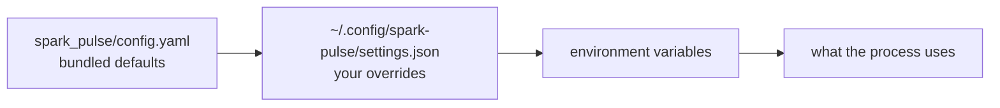

# Configuration

## Where settings come from



Later wins. Secrets live apart, in `~/.config/spark-pulse/secrets.json` (mode `0600`), and are never returned unmasked by the API.

## Core

| Key | Default | What it does |
|---|---|---|
| `webui_port` | `8100` | Port the UI and API listen on. |
| `runtime` | `native` | Deployment runtime. `native` — Spark Pulse drives Docker through the engine registry — is the only one. |
| `spark_vllm_path` | `/tmp/spark-vllm-docker` | Optional read-only checkout, used only as a source of recipes and mods. Nothing is executed out of it. |
| `job_retention_days` | `7` | How long finished deployment records are kept. |
| `deploy_ready_timeout_seconds` | `900` | How long a deploy waits for an engine to report ready. |
| `docker_pull_stall_timeout_seconds` | `300` | Seconds of silence from a pull before it is failed rather than left holding a worker thread. `0` disables. |
| `thread_pool_size` | `40` | Worker threads for synchronous request handlers. |
| `default_port_range_start` / `_end` | `9000` / `9100` | Port range deployments are allocated from. |
| `database_url` | *(empty)* | Empty means SQLite under `~/.config/spark-pulse`. A SQLAlchemy URL otherwise. |
| `cors_allowed_origins` | `[]` | Browser origins allowed to call this API. Empty means the sensible defaults. **Never `*`** — see the [browser boundary](../architecture/overview.md). |

## Cluster and features

| Key | Default | What it does |
|---|---|---|
| `cluster_enabled` | `false` | Offers recipes marked `cluster_only` on the Recipes page. |
| `cluster_experimental` | `true` | Marks multi-node as unproven in the UI. Turn it off once a two-node bring-up has verified it yourself. |
| `benchmarking_enabled` | `false` | Shows the Benchmarking route. |

## Engines

| Key | Default | What it does |
|---|---|---|
| `default_engine` | `vllm` | Engine used when a recipe does not name one. |
| `engine_indexes` | `[…/spark-pulse-engine/index:latest]` | OCI artifacts listing published engine images. |
| `engine_index_cache_ttl_seconds` | `3600` | How long an index is cached. |
| `engines.<name>.enabled` | `true` | Whether an engine is offered at all. Availability of its image is a separate gate. |

## Containers

The `docker:` block is the profile every deployment container is created with:

```yaml
docker:
  privileged: true
  memory_limit_gb: 110
  shm_size_gb: 64
  pids_limit: 4096
  nofile_limit: 1048576
  cache_dirs: [~/.cache/vllm, ~/.cache/flashinfer, ~/.triton]
  keep_entrypoint: false
```

## Image registry

```yaml
image_registry:
  mode: local          # or "proxy" for a pull-through cache
  port: 5000
  address: ""          # empty means detect; never bound to every interface
  upstream: https://ghcr.io
  ttl: "0"             # blob TTL in proxy mode; "0" never expires
  data_dir: ""         # empty means ~/.local/share/spark-pulse/registry
```

## OCI recipe collections

| Key | Default |
|---|---|
| `oci_auto_update_enabled` | `false` |
| `oci_auto_update_schedule` | `0 2 * * *` |
| `oci_auto_update_overwrite_local` | `false` |
| `oci_cache_ttl_seconds` | `300` |
| `oci_background_check_interval_seconds` | `900` |

## MCP and authentication

| Key | Default | What it does |
|---|---|---|
| `mcp_enabled` | `true` | Mounts the MCP JSON-RPC endpoint. |
| `mcp_path` | `/mcp` | Where it is mounted. |
| `mcp_api_token` | *(empty)* | Optional token protecting MCP requests. |
| `auth_enabled` | `false` | Turns on OIDC login and session cookies. |
| `oidc_provider_url`, `oidc_client_id` | *(empty)* | Your provider. |
| `oidc_client_secret` | *(empty)* | Stored in `secrets.json`, never returned by the API. |
| `hf_token` | *(secret)* | Hugging Face token. Only ever returned masked, and never sent to a worker node. |

## Environment variables

| Variable | Overrides |
|---|---|
| `SPARK_VLLM_PATH` | `spark_vllm_path` |
| `WEBUI_PORT` | `webui_port` |
| `SPARK_PULSE_DATABASE_URL` | `database_url` |
| `SPARK_PULSE_AUTH_ENABLED` | `auth_enabled` |
| `SPARK_PULSE_MCP_ENABLED` | `mcp_enabled` |
| `SPARK_PULSE_BENCHMARKING_ENABLED` | `benchmarking_enabled` |
| `SIMULATION_MODE` | Runs everything against the simulated cluster. |

## What the API will and will not change

`PUT /api/settings` writes into `settings.json`, and that file is where `auth_enabled`, `oidc_client_secret` and `mcp_api_token` are read from — so the editable set is an **allowlist**, not a filter. Without one, `{"auth_enabled": false}` would be the way past every other check.

Three kinds, kept apart:

- **Editable** — the allowlist above, plus the `docker:` and `mod:` blocks, which have their own key allowlists.
- **Reported, not editable** — the `environment` block: database, CORS origins, auth, MCP, image registry. So you can see how the process is configured without a browser being able to change it. A `database_url` comes back with any password stripped.
- **Secret** — `hf_token`, only ever masked.
