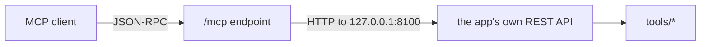

# MCP

Spark Pulse exposes its operations as [Model Context Protocol](https://modelcontextprotocol.io) tools, so an assistant can ask what is running, deploy something, or read a log.

## Two ways in

**HTTP**, mounted on the app itself at `/mcp` (JSON-RPC). It inherits the app's authentication, and `mcp_api_token` can protect it separately.

**stdio**, for clients that spawn a process:

```bash
pip install spark-pulse[mcp]
spark-pulse mcp
```

## How the tools are implemented



Every tool calls the app's REST API over HTTP rather than reaching into the tools directly. That is deliberate: MCP behaviour is REST behaviour by construction, so there is no second implementation to drift, and a fix to an endpoint is a fix to the tool.

## The tools

| Tool | What it does |
|---|---|
| `list_recipes`, `get_recipe` | The recipe catalogue. |
| `plan_deployment` | Resolve a deploy without starting it. |
| `create_deployment` | Deploy. |
| `list_deployments`, `get_deployment_logs` | What is running, and its log. |
| `stop_deployment` | Stop a running deployment, or clear a finished one. Returns as soon as the intent is recorded; the deployment's `sync` field says whether it has settled. |
| `get_memory` | Every node's GPU, memory and disk. |
| `list_images`, `pull_image` | Engine images. |
| `list_engines`, `render_launch` | Engines and the command one would run. |
| `list_models`, `download_model`, `model_download_status` | The model cache. |
| `list_cache`, `clean_cache` | Caches on this host. |
| `list_benchmarks`, `get_benchmark`, `get_latest_by_recipe`, `compare_benchmarks` | Benchmark results, when benchmarking is enabled. |

## Pointing a client at it

```json
{
  "mcpServers": {
    "spark-pulse": {
      "command": "spark-pulse",
      "args": ["mcp"]
    }
  }
}
```

Or, over HTTP, whatever your client's remote-server configuration wants at `http://<host>:8100/mcp`, with the token in an `Authorization` header if you set one.

The **MCP page** in the UI lists the tools this build exposes and the exact snippet for the host it is running on.
